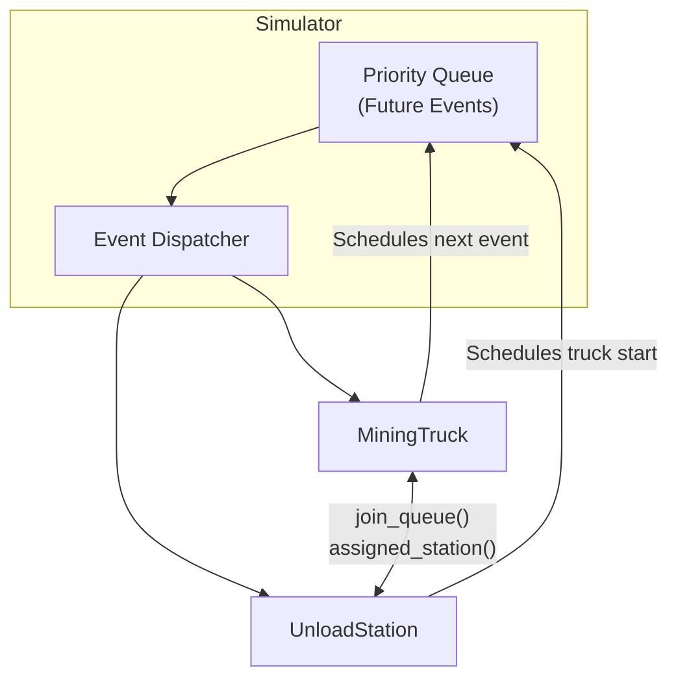
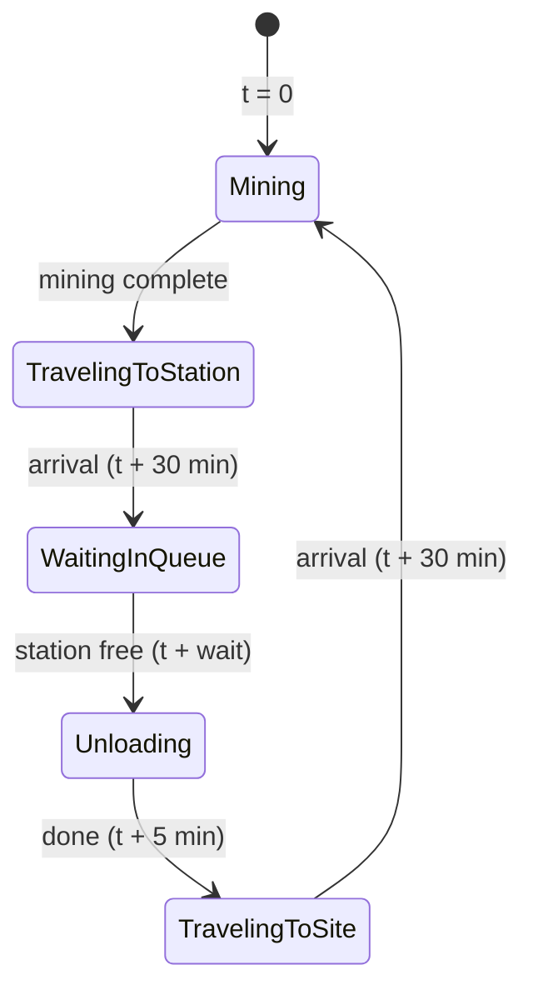

# Helium 3 Mining Simulation

Vast Take Home Coding Exercise - Flight SWE

## Overview

A discrete-event simulation of a 72-hour lunar Helium-3 mining operation.

The simulations runs faster than real-time by simulating only state transistion events rather than advancing a clock at fixed ticks.

## Build/Run

Requires CMake 3.14 or higher and a C++17-capable compiler

### Build

```bash
cmake -S . -B build
cmake --build build
```

This creates two executables under `build/`:
- `helium_3_mining_sim` - the simulation itself
- `helium_3_mining_sim_tests` - runs the unit tests

### Run Simulation

```bash
./build/helium_3_mining_sim [options]

Options:
  -n <trucks>     Number of mining trucks   (default: 10)
  -m <stations>   Number of unload stations (default:  2)
  -s <seed>       RNG seed                  (default: random)
  -h              Show help
```

### Run Tests

```bash
./build/helium_3_mining_sim_tests
```

## Parameters

### Hard-coded parameters

| Parameter | Value |
|-----------|-------|
| Simulation duration | 72 hours |
| Mining duration per trip | Uniform random: 1-5 hours |
| Travel time between site and station) | 30 minutes |
| Unload time per truck | 5 minutes |
| Station capacity | 1 truck at a time. Unlimited trucks allowed to wait in queue |
| Queue assignment | Lowest expected wait time (ties broken by station id) |

### Command-line parameters

| Parameter | Flag | Default |
|-----------|------|---------|
| Number of trucks | -n | 10 |
| Number of stations | -m | 2 |
| Random seed | -s | random via `std::random_device` |

## Design

### Event-driven simulation



### Mining Truck States



### Code structure

| Class/File | Responsibility |
|-------|----------------|
| `sim_config.h` | Constants, truct states definition, `SimConfig` |
| `MiningTruck` | State machine; tracks time per state |
| `UnloadStation` | FIFO queue; manages busy and idle transitions |
| `Simulator` | Event loop; assignment logic; owns all entities |
| `stats_reporter` | Formats and prints statistics |

### Test coverage

| Suite | What is tested |
|-------|----------------|
| `MiningTruck` | All state transitions; state durations accumulate correctly (mining, travel, queue, unloading) |
| `UnloadStation` | Idle/busy transitions; projected wait time; FIFO queue ordering; queue advancement after unloading; utilization and busy/idle statistics |
| `Simulator` | Determinism (same seed = same total trips); time accounting (per-truck state times sum to simulation duration); every truck completes at least one trip; single-truck and single-station edge case (no queueing); total truck trips == total station services |

## Statistics

### Truck statistics

| Column | Meaning |
|--------|---------|
| Trips | Complete mine -> unload cycles finished before sim end |
| Mining | Cumulative time spent extracting Helium 3 |
| Travel | Cumulative travel time (both directions) |
| Queuing | Cumulative time waiting in a station queue |
| Unloading | Cumulative time being unloaded |
| Mine % | `(Mining / Simulation Duration) * 100` - Efficiency metric |

A trip in progress at t = simulation end is not counted (it didn't complete), but the partial-period time is still included in the time columns.

### Station statistics

| Column | Meaning |
|--------|---------|
| Serviced | Trucks fully unloaded |
| Busy | Total minutes actually unloading |
| Idle | Total minutes with no truck present |
| Util % | `Busy / Simulation Duration * 100` |
| Max Queue | Deepest/longest observed waiting queue (excluding the truck being served) |
| Avg Wait | `Total Queue Wait / Trucks Serviced` - Average wait from arrival to start of unload |


## What I Could Add Given More Time

1. Expand the output system to support JSON or CSV for easier integration into other tools for automated analysis
2. Replace the simple test harness with a real unit testing framework like Google Test (and expand on the unit tests)
3. Convert the hard-coded parameters into a configuration options (either via CLI flags or a config file)
4. Introduce a more sophisticated model where mining sites and stations can have different locations (impacting travel times) and different properties (ex: mining duration, unload times, etc.)
5. Different start-up modes for the simulation (ex: warm-up period or configurable pre-populated station lines, etc.)
6. Add support for multiple queue assignment policies (ex: round-robin, random, etc)
7. Optimization mode: fix certain simulation parameters and specific a cost function to search for the most optimal configuration of the remaining parameters

## AI statement

No chat or agent-based AI/LLMs were used to generate any part of this project. GitHub Copilot line completions were used to assist in writing the code.